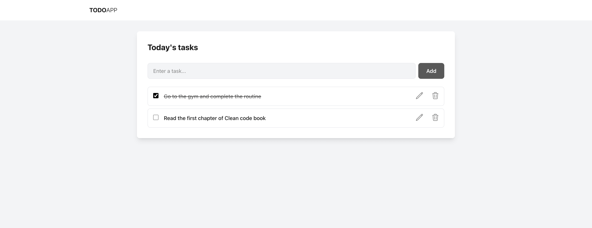
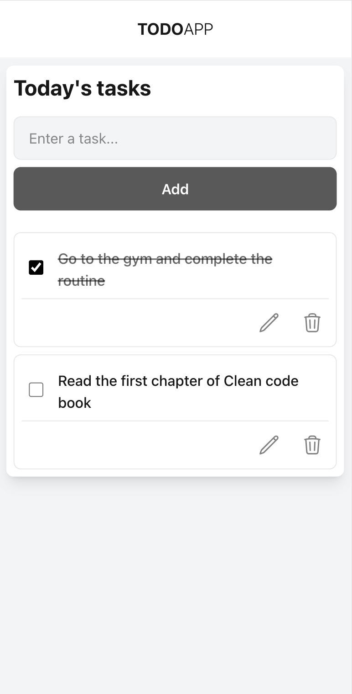

# TODO APP

## Getting Started

First, run the development server:

```bash
npm run dev
# or
yarn dev
# or
pnpm dev
# or
bun dev
```

Open [http://localhost:3000](http://localhost:3000) with your browser to see the result.

## 📌 Overview

This project is an example of a todo app using **Redux**, **Next.js**, and **TypeScript**.

---

## 🖼️ Screenshots

### Light

<div style="display:flex; gap: 12px;">
  
  
</div>

---

## 🚀 Technologies

- Next JS
- React
- TypeScript
- Redux
- Tailwind CSS
- Prettier

---
